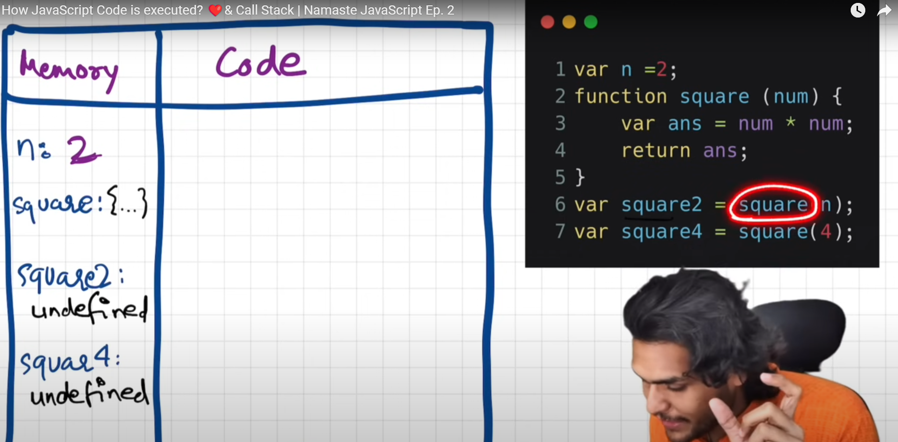

# Execution Context

In JavaScript, everything happens within an **execution context**. There are two main phases in an execution context:

### 1. Memory Phase
   Memory Phase also know as **variable environment**. In this phase, all the variable and function are hoisted. Hoisted means all the variable and function are stored in memory and all the functions and variables stored as key value pairs
   
   - **Key**: Variable or function name
   - **Value**: Assigned value or function definition

   For example: 
   key : value, a : 10, fn : {...}


### 2. Code Phase
This is also know as **Thread of Execuation**. In this phase all code execuate one line at a time it means 

<span style="color:blue">**Note**: JavaScript is a synchronous, single-threaded language.</span>
Single Threaded means JS executes one command at a time and synchronous, single-threaded it means JS can execute one command at a time in a specifc order. so that you can go to next line when the current line has been finished executing.


### 3. How execuation context works for code with example

```js
var n=2;
function square(num){
   var ans = num * num;
   return ans;
}
var square2 = square(n);
var square4 = square(4);
```

in Memory Phase JS scans all the code and allocate memory to all the variables and functions. variable is declared as special value **undefined** and function whole code is copied in memory phase. so for variable n, square2, square4 it is decalred as undefined and function square copied as it is in memory phase. you can see below screenshot.


After scanning whole code in memory phase now turns come for code execuation phase. Here, again JS scans all the code and start replace value of variables. so in below screenshot undefined replace by 2 for variable n.



when turns come for execution of function then it behaves as mini program and again whole new execuation context got created.