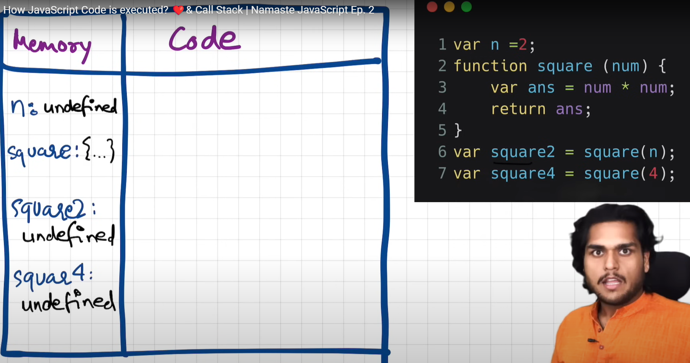
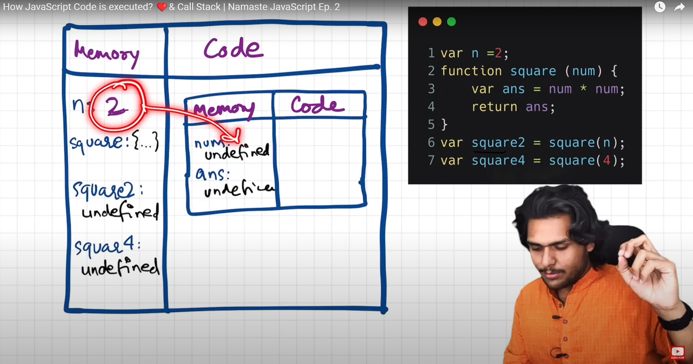
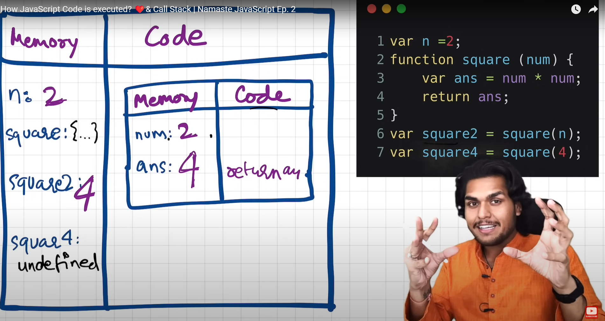
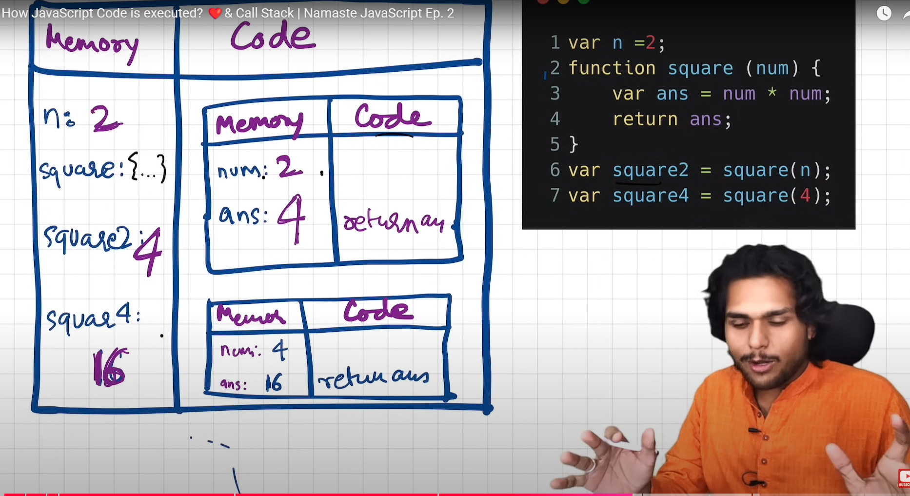
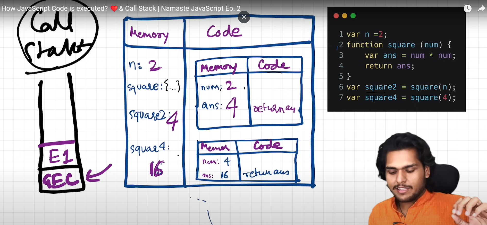
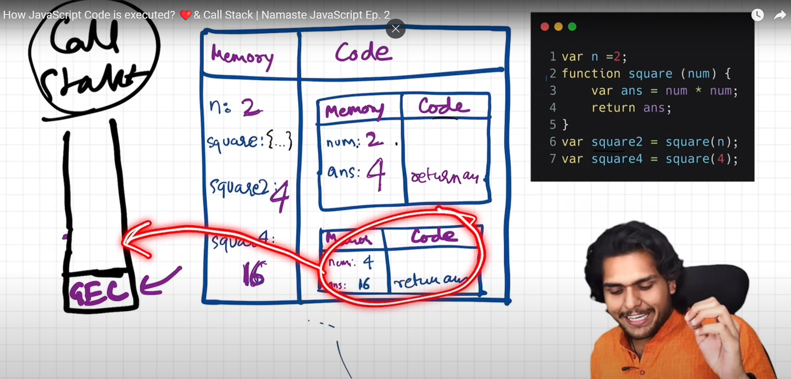

# Execution Context

In JavaScript, everything happens within an **execution context**. There are two main phases in an execution context:

### 1. Memory Phase
Memory Phase is also known as the **variable environment**. In this phase, all the variables and functions are hoisted. Hoisting means all the variables and functions are stored in memory as key-value pairs.

- **Key**: Variable or function name
- **Value**: Assigned value or function definition

For example: 
key: value, a: 10, fn: {...}

### 2. Code Phase
This is also known as the **Thread of Execution**. In this phase, all code executes one line at a time.

<span style="color:blue">**Note**: JavaScript is a synchronous, single-threaded language.</span>
Single-threaded means JS executes one command at a time. Synchronous means JS executes commands in a specific order, moving to the next line only when the current line has finished executing.


### 3. How Execution Context Works with Example

```js
var n=2;
function square(num){
   var ans = num * num;
   return ans;
}
var square2 = square(n);
var square4 = square(4);
```

In the Memory Phase, JS scans all the code and allocates memory to all the variables and functions. Variables are declared with the special value **undefined** and the whole function code is copied in the memory phase. So for variables n, square2, square4, they are declared as undefined and the function square is copied as it is in the memory phase. You can see the below screenshot.



After scanning the whole code in the memory phase, now comes the code Execution phase. Here, again JS scans all the code and starts replacing the values of variables. So in the below screenshot, undefined is replaced by 2 for variable n.


When it comes to the execution of a function, it behaves as a mini program and a whole new Execution context is created.

Now, when it comes to executing square2, it creates a new Execution context and declares values of variables with undefined.




Now the code is executed in the code phase and all the variable values are updated and it returns the 'ans' value to square2 and square2 is updated with 4.



In the same way, an Execution context will be created for the square4 function and it updates the value to 16.



### 3. How JS Manages Execution Context

JavaScript manages execution contexts using a stack known as the call stack. At the bottom of the call stack is the GES (Global Execution Context). When any JavaScript code starts executing, the GES is pushed onto the call stack. When a function is invoked, a new execution context is created and pushed onto the call stack (for the function square2, this will be E1). When the function ends, E1 is popped from the stack, and control returns to the GES. The same process occurs for the function square4, where a new execution context E2 is pushed and then popped from the stack when it completes, returning control to the GES. When the entire program ends, the GES is popped from the call stack.

***Callstack maintains the order of Execution of Execution contexts.***





Alternative names of callstack.

- Execution context Stack
- Program Stack
- Control Stack
- Runtime Stack
- Machine Stack

