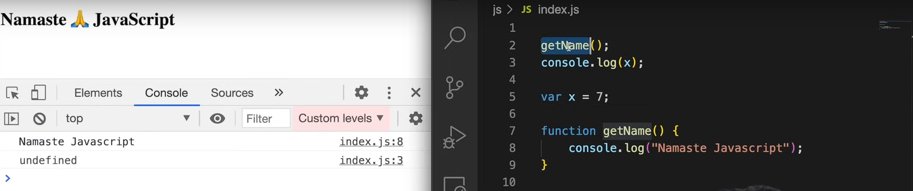
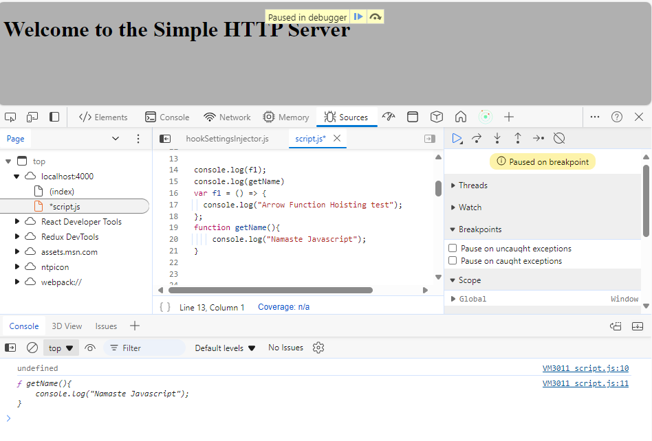

# Hoisting

Hoisting is a JS mechanism where variables and function declarations are moved to the top of their containing scope during the compile phase. That means you can use variables and functions before they are declared in the code.

* Examples

Example 1

Below code is printing the output "Namaste Javascript" and 7:

```js
var x = 7;

function getName() {
    console.log("Namaste Javascript"); // Namaste Javascript
}

getName();
console.log(x); // 7
```

In below code we are trying to access getName and x before initialization. In most programming languages, this shows as an error because we are trying to access them before initialization/declaration.

```js
getName();
console.log(x);

var x = 7;

function getName() {
    console.log("Namaste Javascript");
}
```

So, the above code will print the output "Namaste Javascript" and "undefined". Hoisting is a concept where you can access variables before their declaration. This occurs due to the execution context, where during the memory phase, all variables are declared before the code is executed.



Example 2

```js
console.log(f1);
console.log(getName)
var f1 = () => {
    console.log("Arrow Function Hoisting test");
};

function getName() {
    console.log("Namaste Javascript");
}
```

In the case of the arrow function f1, it will print as undefined because it behaves like a variable if used before declaration. However, the traditional function getName() will print the function definition.



**Note**: `` `let` ` ` and ` ` `const` `` are declared as "Not Available" and hoisting does not work with them.

To understand this more try given examples below

```js
// console.log(x);
// var x = 10;
// console.log(getName)
// function getName() {
//   console.log("inside funtion");
// }
// getName();

// console.log(f1);
// console.log(getName)
// var f1 = () => {
//   console.log("Arrow Function Hoisting test");
// };
// function getName(){
//     console.log("Namaste Javascript");
// }

// var f1 = () => {
//   console.log("Arrow Function Hoisting test");
// };
// console.log(f1);

// const n = 10;
// console.log(n); // 10
// function duplicate() {
// //   let n = 20;
//   console.log(n); // 20 
// }
// console.log(n); //10
// duplicate();
// console.log(n); //

// var a1 = 19;
// console.log(a1);
// function a3() {
//     var a6 = 10;
//     function a5() {
//         console.log(a6);
//     }
//     a5();
//   console.log("inside funtion");
// }
// a3();
// var a2 = 10;
// console.log(a2);

/**
 * 
 * script.js:34 
 Uncaught ReferenceError: Cannot access 'a4' before initialization
    at script.js:34:13
(anonymous)	@	script.js:34
 */
// three scopes -> loaal, global, closure need to understand more.
```
