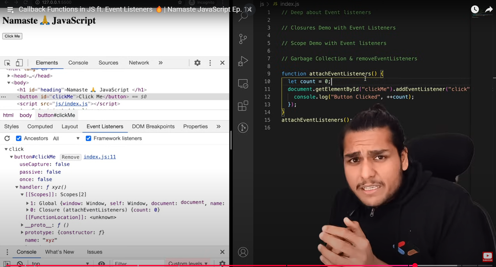

#### what is callback functions in Javascript?

Functions are first-class citizens in JavaScript, meaning they can be passed as arguments to other functions. A function that is passed as an argument to another function is called a callback function. 

**Note** : Run the code below, add a debugger statement, and closely observe the call stack during execution.

```js
setTimeout(function() {
    console.log("Timer")
}, 5000)

function x(y) {
    console.log("x")
    y();
}
console.log("hello")
x(function y() {
    console.log("y")
}) // here y is callback function
```

#### Deep about Event Listeners

* What are Event Listeners?
  + Event listeners are functions that are attached to DOM elements to listen for specific events (e.g., click, mouseover, keydown).
  + When the event occurs, the listener executes the attached callback function.
* Event Listeners and Closures
  + Event listeners often create closures because the callback function retains access to the variables in its outer scope, even after the outer function has executed.
  + This behavior can lead to memory leaks if event listeners are not properly managed.

```html
<!DOCTYPE html>
<html lang="en">

<head>
    <meta charset="UTF-8">
    <meta name="viewport" content="width=device-width, initial-scale=1.0">
    <title>Simple HTTP Server</title>

</head>

<body>
    <h1>Hello, Let's Play with some code</h1>
    <button id="clickMe">Click me</button>
    <script src="script.js"></script>
</body>

</html>
```

```js
function attachEventListeners() {
    let count = 0
    document.getElementById("clickMe")
        .addEventListener("click", function click() {
            console.log("button clicked", ++count)
        })
}
attachEventListeners()
```

* How It Works:
1. The attachEventListeners function is executed, and the count variable is initialized to 0.
2. The click event listener is attached to the button with ID clickMe.
3. Each time the button is clicked, the callback function executes and increments the count variable.
4. The callback function forms a closure, retaining access to the count variable even after attachEventListeners has finished executing.



#### Garbage collection & removeEventListeners

* Garbage Collection in JavaScript:
  + Garbage Collection is the process by which JavaScript 
  + automatically frees up memory by removing objects that are no longer accessible or needed.
  + The JavaScript engine (e.g., V8) uses algorithms like Mark-and-Sweep to identify and clean up unused memory.
  + When does garbage collection occur?
    - When there are no references to an object.
    - When variables go out of scope.
* Debugging Event Listeners
  + Use the debugger in your browser's developer tools to observe how event listeners work and how closures are formed.
  + Steps:
    - Add a debugger statement inside the callback function.
    - Click the button and observe the call stack and scope in the developer tools.

```js
let obj = {
    name: "John"
};
obj = null; // The object is now eligible for garbage collection.
```

* Why removeEventListeners is Important:
  + Event listeners can create closures, which may retain references to variables in their scope.
  + If event listeners are not removed when they are no longer needed, they can cause memory leaks because the references prevent garbage collection.
  + Best Practice: Always remove event listeners when they are no longer needed.
  
* How to Remove Event Listeners:
  + How to Remove Event Listeners:

```js
function handleClick() {
    console.log("Button clicked");
}

const button = document.getElementById("clickMe");
button.addEventListener("click", handleClick);

// Remove the event listener
button.removeEventListener("click", handleClick);
```
